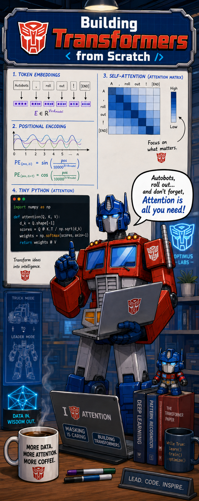

<table>
<tr>
<td valign="top" width="55%">

# Transformers from Scratch

A personal learning lab for building transformer models from the ground up using PyTorch.

The goal is to deeply understand modern transformer architecture — from self-attention basics through
complete seq2seq and decoder-only models — by implementing each component independently, writing
original explanations, and validating understanding through unit-tested code.

This repo follows the chapter progression of
[*Building Transformer Models from Scratch with PyTorch*](https://machinelearningmastery.com/building-transformer-models-from-scratch-with-pytorch-10-day-mini-course/)
by Adrian Tam (Machine Learning Mastery), used here as a private study reference.
All code and explanations are original — no content from the book is reproduced here.

> This is not an official companion repository and is not affiliated with or endorsed by the author
> or publisher.

</td>
<td valign="top" align="center" width="45%">

</td>
</tr>
</table>

---

## Project Structure

```
Transformers_fromScratch/
├── src/
│   └── transformer_book_lab/   # Reusable PyTorch modules
├── tests/                      # pytest unit tests
├── notebooks/                  # Chapter Jupyter notebooks
├── docs/
│   ├── chapter-notes/          # Extended notes per chapter
│   ├── architecture-decisions/ # Architecture Decision Records
│   ├── learning-log.md         # Running learning journal
│   └── copyright-and-attribution.md
├── experiments/                # Standalone experiment scripts and configs
├── openspec/                   # Spec-driven change proposals and templates
├── ref/                        # GITIGNORED — local PDF + official sample code
├── pyproject.toml
└── README.md
```

---

## Installation

```bash
# Clone
git clone https://github.com/FederCO23/Transformers_fromScratch.git
cd Transformers_fromScratch

# Create and activate a virtual environment
python -m venv .venv

# Windows
.venv\Scripts\activate
# macOS / Linux
# source .venv/bin/activate

# Install the project and dev dependencies
pip install -e ".[dev]"
```

### Run the tests

```bash
pytest
```

### Launch notebooks

```bash
jupyter lab notebooks/
```

---

## Chapter-by-Chapter Learning Approach

Each chapter follows a consistent delivery pattern:

| Artifact | Description |
|---|---|
| **Notebook** | Original explanation + runnable PyTorch code |
| **Summary** | Short writeup in my own words (inside the notebook) |
| **Module** | Reusable component in `src/transformer_book_lab/` when the concept deserves one |
| **Tests** | `pytest` unit tests for every reusable module |
| **Final exercise** | An original problem demonstrating the chapter concept |
| **Extensions** | Optional stretch work beyond the book scope |

---

## Chapter Notebooks

| # | Notebook | Topic |
|---|---|---|
| 01 | [01_intro_attention_transformers.ipynb](notebooks/01_intro_attention_transformers.ipynb) | Introduction to Attention and Transformers |
| 02 | [02_encoders_decoders.ipynb](notebooks/02_encoders_decoders.ipynb) | Encoders and Decoders |
| 03 | [03_tokenizers.ipynb](notebooks/03_tokenizers.ipynb) | Tokenizers |
| 04 | [04_word_embeddings.ipynb](notebooks/04_word_embeddings.ipynb) | Word Embeddings |
| 05 | [05_positional_encodings.ipynb](notebooks/05_positional_encodings.ipynb) | Positional Encodings |
| 06 | [06_context_window_yarn.ipynb](notebooks/06_context_window_yarn.ipynb) | Context Window and YaRN |
| 07 | [07_mha_gqa_mqa.ipynb](notebooks/07_mha_gqa_mqa.ipynb) | Multi-Head, Grouped-Query, Multi-Query Attention |
| 08 | [08_mla.ipynb](notebooks/08_mla.ipynb) | Multi-Latent Attention (MLA) |
| 09 | [09_attention_masking.ipynb](notebooks/09_attention_masking.ipynb) | Attention Masking |
| 10 | [10_layernorm_rmsnorm.ipynb](notebooks/10_layernorm_rmsnorm.ipynb) | LayerNorm and RMSNorm |
| 11 | [11_linear_layers_activations.ipynb](notebooks/11_linear_layers_activations.ipynb) | Linear Layers and Activations |
| 12 | [12_mixture_of_experts.ipynb](notebooks/12_mixture_of_experts.ipynb) | Mixture of Experts |
| 13 | [13_skip_connections.ipynb](notebooks/13_skip_connections.ipynb) | Skip Connections |
| 14 | [14_seq2seq_translation.ipynb](notebooks/14_seq2seq_translation.ipynb) | Seq2Seq Translation (RNN baseline) |
| 15 | [15_seq2seq_attention_translation.ipynb](notebooks/15_seq2seq_attention_translation.ipynb) | Seq2Seq + Attention Translation |
| 16 | [16_transformer_translation.ipynb](notebooks/16_transformer_translation.ipynb) | Full Transformer Translation |
| 17 | [17_decoder_only_text_generation.ipynb](notebooks/17_decoder_only_text_generation.ipynb) | Decoder-Only Text Generation |

---

## Roadmap

**Phase 1 — Scaffold and repo standards** ✅  
Project structure, tooling, and development conventions.

**Phase 2 — Architecture overview (Ch 1–2)**  
High-level intuition for attention mechanisms and the encoder–decoder architecture.

**Phase 3 — Building blocks (Ch 3–13)**  
One notebook per component: tokenizers, embeddings, positional encodings, context windows,
attention variants, normalization, feed-forward layers, MoE, and skip connections.

**Phase 4 — Complete models (Ch 14–17)**  
Full seq2seq translation, attention-enhanced seq2seq, complete transformer, and decoder-only
text generation.

**Phase 5 — Original extensions**  
Attention weight visualizations, NumPy reference implementations, reproducible experiment configs,
and original chapter exercises.

---

## Copyright and Attribution Policy

The book *Building Transformer Models from Scratch with PyTorch* and its official sample code are
copyrighted by Adrian Tam / Machine Learning Mastery. Neither the ebook text nor the publisher's
sample code is included in this repository.

All code in `src/`, `notebooks/`, `tests/`, and `experiments/` is original work by Federico Bessi,
released under the MIT License. A gitignored `ref/` folder holds a local copy of the PDF and
official sample code — it is never committed to the remote.

---

## License

MIT © 2026 Federico Bessi — see [LICENSE](LICENSE).
